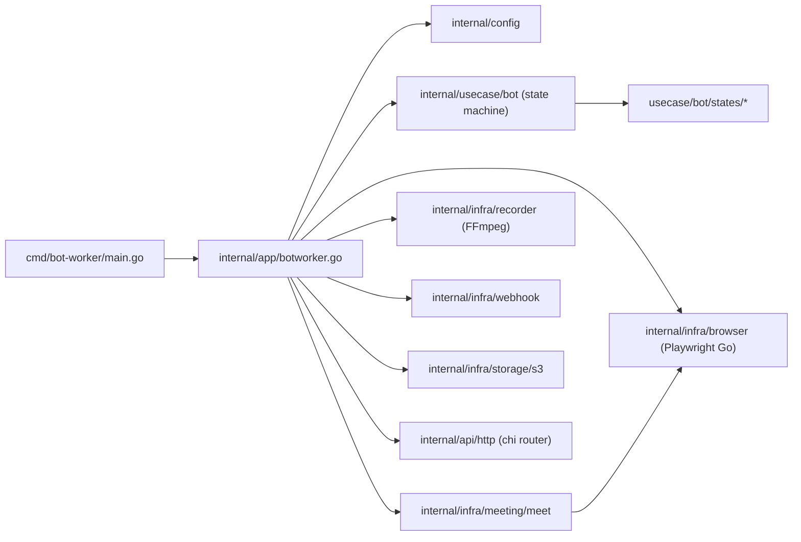

# Architecture Status — meet-bot-go

> Bản đánh giá hiện trạng kiến trúc và mức độ hoàn thiện của các tính năng.
> Cập nhật: May 2026.
> Đối chiếu: [docs/system-design.md](../../docs/system-design.md) (root repo) và [docs/implementation-plan.md](../../docs/implementation-plan.md).

---

## 1. Composition root canonical



- **Module**: `github.com/PhucNguyen204/Meeting-BaaS`, Go `1.24` (toolchain `1.24.5`).
- **Composition root canonical** (binary `bot-worker`):
  `cmd/bot-worker` → `internal/app/botworker.go` → {`usecase/bot` (state machine), `infra/*` (browser/meeting/recorder/webhook/dialog/snapshot/speaker/storage), `api/http`, `config`}.
- **Phương án sidecar Node + gRPC** mô tả ở `docs/implementation-plan.md` Phase 1 **đã bị thay** bằng port toàn bộ Meet automation sang Go bằng [Playwright Go](https://github.com/playwright-community/playwright-go). Quyết định ghi tại [decision-records/0001-playwright-go-vs-node-sidecar.md](decision-records/0001-playwright-go-vs-node-sidecar.md).

## 2. Cấu trúc thư mục đang dùng

```
meet-bot-go/
├── cmd/
│   ├── bot-worker/           # canonical entrypoint, build OK
│   ├── api-server/           # STUB
│   └── controller/           # STUB
├── configs/                  # bot.config.example.json + config.dev.yaml
├── deployments/docker/       # Dockerfile + compose dev (redis + postgres + minio + mailhog)
├── docs/                     # docs riêng cho meet-bot-go
├── internal/
│   ├── api/http/             # chi router, /healthz /version /status /stop_record /pause /resume
│   ├── app/                  # composition root cho bot-worker, api-server (stub)
│   ├── config/               # BotConfig + viper loader + validator
│   ├── constants/            # meeting_constants.go
│   ├── domain/               # interfaces & alias types (BrowserDriver, Page, …)
│   ├── infra/
│   │   ├── browser/          # Playwright Go driver
│   │   ├── dialog/           # popup observer (STUB)
│   │   ├── meeting/
│   │   │   ├── meet/         # Meet automation (port từ src/meeting/meet/*)
│   │   │   └── teams/        # url_parser only
│   │   ├── recorder/         # FFmpeg builder + ScreenRecorder + ffprobe
│   │   ├── snapshot/         # HTML snapshot + screenshot
│   │   ├── speaker/          # Speaker manager
│   │   ├── storage/
│   │   │   ├── postgres/     # .gitkeep
│   │   │   ├── redis/        # client + subscribe stop signal
│   │   │   └── s3/           # AWS SDK v2 client
│   │   └── webhook/          # Sender + BotWebhooker
│   ├── pkg/                  # async / errors / logger / retry / sleep / timing / version
│   └── usecase/
│       └── bot/              # canonical state machine + 9 states
└── tools/                    # toolchain pin
```

## 3. Cây ghost (cần dọn — không được import)

Các thư mục dưới đây tồn tại do refactor dở dang. Chạy `rg -l "\"github.com/PhucNguyen204/Meeting-BaaS/internal/<dir>\""` cho từng prefix bên dưới sẽ ra **0 hit** trong `cmd/*` hay `internal/app/*`:

| Đường dẫn | Số file `.go` | Lý do |
|---|---|---|
| `internal/adapter/` | 46 | Trùng `internal/infra/*` (đặt tên hexagonal cũ) |
| `internal/infrastructure/` | 39 | Trùng `internal/infra/*` (đặt tên DDD cũ) |
| `internal/logic/` | ~57 | Trùng cả state machine + infra |
| `internal/application/statemachine/` | 13 | Trùng `internal/usecase/bot/*` |
| `internal/handler/http/` | 6 | Trùng `internal/api/http/*` |
| `internal/adapter/http/` | 6 | Trùng `internal/api/http/*` |
| `internal/usecase/statemachine/` | n/a | Trùng `internal/usecase/bot/*` |
| `internal/dataaccess/{redis,s3}` | n/a | Trùng `internal/infra/storage/*` |

**Kế hoạch dọn**: Phase 7 mới (xem [implementation-plan.md](../../docs/implementation-plan.md)). Verify trước khi xóa bằng `rg -l "internal/(adapter|infrastructure|logic|application|handler|usecase/statemachine|dataaccess)" --glob '!docs/**'`.

## 4. Bảng đối chiếu Phase với hiện trạng

| Phase | Mục tiêu plan gốc | Trạng thái thực tế | Ghi chú |
|---|---|---|---|
| **0** Bootstrap | `go.mod`, Makefile, CI, proto, browser-driver Node stub | **PARTIAL** | `bot-worker` build OK; `api-server`/`controller` stub; CI **thiếu**; Makefile có lỗi `MODULE := github.com/yourorg/meet-bot-go` không khớp `go.mod`. |
| **1** Browser-driver | Node sidecar + gRPC | **DIVERGED** | Thay bằng Playwright Go in-process tại `internal/infra/browser/playwright_driver.go` + `internal/infra/meeting/meet/*`. |
| **2** State machine + recorder + control HTTP | 9 state + recording-state đầy đủ + ffmpeg + offset/finalize | **PARTIAL** | 9 state có; recorder spawn `ffmpeg` + signal; HTTP control đủ route. Thiếu: recording parity TS (alone-in-meeting, no-speaker, attendees update); `finalize.go`; pause/resume HTTP chưa nối `MeetingContext.IsPaused`; `/status` trả stub `0/false/""`. |
| **3** API server + Redis + PG | REST API + queue + spawner | **STUB** | `internal/app/apiserver.go` `Run` trả `ErrNotImplemented`. Chưa có migrations, repo Postgres, Redis Stream, spawner. |
| **4** Webhook + S3 | Webhook lifecycle đủ events + S3 upload | **PARTIAL** | `infra/webhook/sender.go` + `BotWebhooker` có; **`Uploader: nil`** trong `NewBotWorker` → upload không chạy. |
| **5** Streaming + speaker observer | WS streamer + speaker observer JS binding | **STUB** | `audio_capture.go` trả `not implemented`; `speakers_observer.Attach` no-op; chưa có WS streamer. |
| **6** K8s + observability | Helm chart, K8s Job, metrics, tracing | **NOT STARTED** | `deployments/helm/.gitkeep`. |

## 5. Tính năng đã triển khai (so với bản TS gốc)

| Tính năng | Ref TS | Trạng thái Go | File |
|---|---|---|---|
| BotConfig (`MeetingParams`) parsing | `src/types.ts` | COMPLETE | [internal/config/config.go](../internal/config/config.go) |
| Config validator + masked logging | `src/main.ts:217-224` | COMPLETE | [internal/config/{validator,config}.go](../internal/config) |
| Detect provider (Meet/Teams/Zoom) | `src/utils/detectMeetingProvider.ts` | COMPLETE | `internal/infra/meeting/detect_provider.go` |
| URL parser Meet | `src/urlParser/meetUrlParser.ts` | COMPLETE | `internal/infra/meeting/meet/url_parser.go` |
| URL parser Teams | `src/urlParser/teamsUrlParser.ts` | COMPLETE | `internal/infra/meeting/teams/url_parser.go` |
| State machine engine (9 states) | `src/state-machine/machine.ts` | COMPLETE | [internal/usecase/bot/machine.go](../internal/usecase/bot/machine.go) |
| Initialization → WaitingRoom → InCall → Recording → Cleanup → Terminated | `src/state-machine/states/*` | PARTIAL | [internal/usecase/bot/states/*](../internal/usecase/bot/states) |
| Pause / Resume state | `paused-state.ts`, `resuming-state.ts` | PARTIAL | logic OK, chưa nối HTTP |
| Browser driver (Playwright) | `src/browser/browser.ts` | COMPLETE single-session | `internal/infra/browser/playwright_driver.go` |
| Meet open page + state detector + join | `src/meeting/meet/*` | PARTIAL | `internal/infra/meeting/meet/*` |
| FFmpeg screen+audio recorder | `src/recording/ScreenRecorder.ts` | PARTIAL | `internal/infra/recorder/recorder.go` |
| ffprobe wrapper | (no direct TS) | COMPLETE | `internal/infra/recorder/offset.go` (chỉ Probe; thiếu CalculateOffset) |
| Webhook sender + retry/circuit-breaker | `src/events.ts` | PARTIAL | `internal/infra/webhook/sender.go` |
| HTTP control (`/stop_record`, `/pause`, `/resume`, `/status`, `/version`, `/healthz`) | `src/server.ts` | PARTIAL | `internal/api/http/*` (transport OK, wiring stub) |
| S3 client (PutObject, MinIO compat) | `src/utils/S3Uploader.ts` | PARTIAL | `internal/infra/storage/s3/client.go` (uploader không nối vào BotWorker) |
| Redis client + subscribe stop | (Redis là phương án Go) | PARTIAL | `internal/infra/storage/redis/client.go` |
| Audio capture (Web Audio API binding) | `src/meeting/meet/audio-capture.ts` | **STUB** | `internal/infra/meeting/meet/audio_capture.go` |
| Speakers observer | `src/meeting/speakersObserver.ts` | **STUB** | `internal/infra/meeting/meet/speakers_observer.go` |
| Dialog observer | `src/services/dialog-observer/*` | **STUB** | `internal/infra/dialog/observer.go` |
| Streaming WS (Int16 PCM 24kHz) | `src/streaming.ts` | **MISSING** | — |
| Recording-state full checks (alone-in-meeting, no-speaker, no-attendees, sound monitor) | `src/state-machine/states/recording-state.ts` (~600 dòng) | PARTIAL | `internal/usecase/bot/states/recording.go` đơn giản hơn |
| Recording finalize (output.mp4 + output.wav + offset) | `src/recording/ScreenRecorder.ts` + `src/utils/CalculVideoOffset.ts` | **MISSING** | — |
| HTML cleaner | `src/meeting/htmlCleaner.ts` | PARTIAL | `internal/infra/meeting/meet/html_cleaner.go` |
| HTML snapshot service | `src/services/html-snapshot-service.ts` | PARTIAL | `internal/infra/snapshot/service.go` |
| Sound level monitor | `src/utils/sound-level-monitor.ts` | **MISSING** | — |
| Branding (custom avatar/video) | `src/branding.ts` | DEFERRED | — |
| API server (`POST /v1/bots`, REST CRUD) | (mới — không có TS) | **STUB** | `internal/app/apiserver.go` |
| Controller (consume Redis Stream → spawn) | (mới) | **STUB** | `cmd/controller/main.go` |
| Postgres migrations | (mới) | **MISSING** | — |
| Redis Streams queue (XADD/XREADGROUP) | (mới) | **MISSING** | — |
| K8s Helm chart | (mới) | **MISSING** | `deployments/helm/.gitkeep` |
| Observability (Prometheus / OpenTelemetry) | (mới) | **MISSING** | — |
| GitHub Actions CI | (mới) | **MISSING** | — |

## 6. Test coverage đang có

12 file `_test.go` thực sự (loại trừ ghost trees):

- [internal/config/config_test.go](../internal/config/config_test.go) — table-driven, edge cases tốt.
- [internal/usecase/bot/machine_test.go](../internal/usecase/bot/machine_test.go) — happy path + error path qua mock state.
- [internal/infra/meeting/meet/url_parser_test.go](../internal/infra/meeting/meet/url_parser_test.go), `teams/url_parser_test.go`, `meeting_test.go` (DetectProvider).
- [internal/infra/recorder/recorder_test.go](../internal/infra/recorder/recorder_test.go) — FFmpegBuilder args, Stop/Pause no-op.
- [internal/infra/webhook/webhook_test.go](../internal/infra/webhook/webhook_test.go) — httptest success/error.
- [internal/infra/dialog/dialog_test.go](../internal/infra/dialog/dialog_test.go), `speaker/speaker_test.go`.
- `internal/pkg/{retry,sleep,logger}_test.go`.

**Còn thiếu**: integration tests (testcontainers Postgres / Redis / MinIO), E2E (kind cluster), recorder integration test (chạy ffmpeg thật), playwright smoke test trên Meet sandbox.

## 7. Hạ tầng & DevOps

| Khu | Trạng thái |
|---|---|
| Docker compose dev (redis, postgres, minio, mailhog) | OK |
| Dockerfile bot-worker | OK (Ubuntu 24.04 + Xvfb + PulseAudio + ffmpeg) |
| Dockerfile api-server / controller | **MISSING** |
| postgres-init.sql (schema 1-cục) | OK nhưng nên thay bằng migrations |
| `*.up.sql / *.down.sql` migrations | **MISSING** |
| Helm chart (`Chart.yaml` + templates) | **MISSING** |
| K8s manifests (Job/Deployment/Service) | **MISSING** |
| `.github/workflows/ci.yml` | **MISSING** |
| `.golangci.yml` config | OK (errcheck, govet, staticcheck, revive, gocritic, gosec, bodyclose, gofmt, goimports) |
| Makefile (build/test/lint/docker) | OK nhưng ldflags `MODULE` sai |

## 8. Tech debt nổi bật

1. **MODULE mismatch trong Makefile** — `MODULE := github.com/yourorg/meet-bot-go` ở [Makefile:6](../Makefile) sẽ embed sai version metadata vào binary (Go ignores `-X` cho package không tồn tại, nên hiệu quả là metadata trống). Đổi thành `github.com/PhucNguyen204/Meeting-BaaS`.
2. **4 cây ghost** (xem mục 3) — tăng diện tích maintain, làm rối khi `gopls`/IDE jump-to-definition.
3. **`Uploader: nil`** trong `NewBotWorker` — Phase 4 chưa ship được upload S3 dù client đã có.
4. **Pause/Resume HTTP** trả `pause not yet wired` — endpoint tồn tại nhưng vô tác dụng.
5. **`/status`** luôn trả `start_time=0, is_paused=false, end_reason=""` — `machineStatusProvider` là stub.
6. **3 in-page bindings stub**: `audio_capture.go`, `speakers_observer.go`, `dialog/observer.go`. Đây là phần khó nhất khi port từ TS sang Go (cần inject JS payload đúng + binding via `Page.ExposeFunction`).
7. **Recording-state simplified** — bản TS [src/state-machine/states/recording-state.ts](../../src/state-machine/states/recording-state.ts) ~600 dòng với `checkAloneInMeeting`, `checkNoSpeaker` (kết hợp `LastSpeakerTime` + `NoSpeakerDetectedTime` + sound monitor + grace 5'); bản Go hiện tại chỉ ~95 dòng, chưa cập nhật `NoSpeakerDetectedTime` từ observer.
8. **File rác trong root**: `meet-bot-go/c`, `meet-bot-go/coverage` (binary), `meet-bot-go/coverage.out`, `meet-bot-go/bot-worker.exe`, `cmd/bot-worker/main.go.5781487861480757649`. Cần `git rm` và bổ sung `.gitignore`.
9. **`internal/generated/.gitkeep`** vô nghĩa — không còn dùng proto/openapi.
10. **`postgres-init.sql` 1 cục** — không versioned, không rollback được. Phase 3 phải thay bằng `migrations/00{1..n}_*.{up,down}.sql` + `golang-migrate`.

## 9. Kết luận ngắn

- **Bot-worker** đã chạy được end-to-end (init → join Meet → record → cleanup) cho mode standalone (đọc `bot.config.json` từ stdin); 3 in-page bindings (audio capture, speakers observer, dialog observer) **đã port** sang Go bằng Playwright `AddInitScript` + `ExposeFunction`; recorder có `finalize.go` (mp4 fast-start + mono 16 kHz wav + offset).
- **Service mode** (api-server + controller + spawner) đã có **skeleton hoạt động**: `POST /v1/bots` insert Postgres + XADD Redis Streams; controller `XREADGROUP` rồi spawn `os/exec ./bin/bot-worker`. Phần thay K8s Job sẽ chuyển sang Phase 6.
- **Integration tests** với `testcontainers-go` cho Postgres + Redis + MinIO chạy được sau build tag `integration` (`make test-integration`); CI có job riêng `integration` chạy chúng trên Docker-in-Linux runner.

### Đã làm trong đợt cleanup + Phase 2/3 này

| Hạng mục | Sản phẩm |
|---|---|
| Docs | `architecture-status.md`, ADR `0001-playwright-go-vs-node-sidecar.md`, README rewrite, `implementation-plan.md` Phase 1' + Phase 7 |
| Cleanup | Xóa 4 cây ghost (`adapter/`, `infrastructure/`, `logic/`, `application/`, `handler/`, `usecase/statemachine/`, `dataaccess/`) + file rác |
| Tooling | Sửa `Makefile` `MODULE`, thêm targets `migrate-up/down/create`, `test-short`, `cover`, `test-integration`; CI GitHub Actions (`test`, `lint`, `integration`) |
| Bot-worker wiring | `S3 Uploader` từ env, HTTP `pause/resume` + `/status` nối thật vào `MeetingContext` (mutex-guarded) |
| In-page bindings | `meet/audio_capture.go` (Web Audio API mixer + `processMixedAudioChunk`), `meet/speakers_observer.go` (DOM `MutationObserver`), `dialog/observer.go` (Playwright Locator polling) |
| Recording state parity | `checkAloneInMeeting`, `checkNoSpeaker`, `checkNoOneJoined`, `updateAttendees` qua `SpeakerSnapshot` interface |
| Recorder finalize | `internal/infra/recorder/finalize.go` (probe + remux mp4 faststart + extract wav + apply offset) |
| Phase 3 skeleton | 4 migrations (`bots`, `bot_events`, `recordings`, `webhook_deliveries`); `postgres.Pool` + `BotRepo`; `queue.Producer/Consumer` (Redis Streams) + `PublishStop` (Pub/Sub); `internal/app/apiserver.go` + `internal/app/controller.go` + main wiring |
| Integration tests | `testcontainers-go` cho Postgres (CRUD `BotRepo`), Redis (XADD/XREADGROUP/XACK + Pub/Sub stop), MinIO (`UploadFile` round-trip) |

### Đã làm trong batch API server v2 đầy đủ

| Hạng mục | Sản phẩm |
|---|---|
| Migrations 005-010 | `tenants`, `users`, `teams`, `team_members`, `secrets` (envelope encryption), `api_keys` (hashed), `idempotency_keys`, `ALTER TABLE bots` thêm 18 cột v2 (tenant_id, api_key_id, idempotency_key, deduplication_hash, transcription_*, streaming_*, callback_*, join_at, allow_multiple_bots, extra JSONB, data_deleted_at, deleted_at), `alerts`, `usage_records`, `webhook_endpoints`, `webhook_event_outbox`, `data_retention_jobs` |
| Repos | `TenantRepo`, `UserRepo`, `APIKeyRepo` (Issue/LookupByPlaintext/Revoke/MarkUsed), `IdempotencyRepo` (BeginRequest/CompleteRequest), `BotRepo.InsertV2/GetV2/GetStatusLight/MarkDataDeleted`, `AlertsRepo`, `UsageRepo`, `OutboxRepo`, `RetentionRepo` |
| Middleware | `Auth` (Bearer + x-meeting-baas-api-key + Redis cache), `RateLimit` (per-key INCR), `Idempotency` (capture + replay), `RequestLogger` (zap), `Recover` (panic → INTERNAL envelope) |
| Response envelope | Package `respond` chung cho v2 + middleware (tránh import cycle); 10 mã lỗi chuẩn Meeting BaaS |
| Endpoints v2 | 11 endpoints: `POST /bots`, `POST /bots/scheduled`, `GET /bots/{id}`, `GET /bots/{id}/status`, `POST /bots/{id}/leave-bot`, `POST /bots/{id}/pause-recording`, `POST /bots/{id}/resume-recording`, `POST /bots/{id}/chat-messages`, `DELETE /bots/{id}/delete-data`, `GET /usage`, `GET /alerts` |
| Bot-worker command channel | Subscribe Redis Pub/Sub `bot:cmd:<uuid>`, dispatch pause/resume/chat tới `MeetingContext` + `meet.SendEntryMessage` |
| Backward compat | `/v1/bots` (POST/GET/{id}/stop) giữ nguyên không auth cho client cũ |
| Tests | Unit: middleware auth/rate-limit (miniredis), v2 validateCreate / detectProvider / leave-bot 503; Integration: end-to-end `POST /v2/bots` qua testcontainers postgres+redis (insert row + XADD + idempotent replay + GET) |
| Docs | `docs/api-server.md` — auth + idempotency + rate-limit + 11 endpoints + error codes + examples + cấu hình env; cập nhật mục 9 status này |

### Việc còn lại để khép Phase 4–6

- Webhook delivery worker (drain `webhook_event_outbox` với `FOR UPDATE SKIP LOCKED`, retry với backoff, SVIX-style signing) — Phase 4.
- Streaming WS (Phase 5) — audio capture đã sẵn sàng feed; cần WebSocket server + resample 48→24kHz.
- Calendar endpoints (`/v2/calendars/**`) — Phase 5.5.
- Transcription provider integration thật (Gladia/Deepgram) — Phase 4 sau outbox.
- MongoDB collections cho transcripts/speaker_timeline/screenshots — phase tới khi STT integration.
- K8s Job spawner thay `os/exec` (Phase 6) + Helm chart.
- Observability: Prometheus `/metrics` + OpenTelemetry traces.
- Stripe billing integration — Phase 7.
- Apply RLS thực (per-request `SET LOCAL app.tenant_id`) — schema đã sẵn, cần per-request conn từ pgxpool.

Xem chi tiết roadmap tại [implementation-plan.md](../../docs/implementation-plan.md), thiết kế DB tại [database-design.md](database-design.md), REST contract tại [api-server.md](api-server.md), và quyết định kiến trúc tại [decision-records/0001-playwright-go-vs-node-sidecar.md](decision-records/0001-playwright-go-vs-node-sidecar.md).
