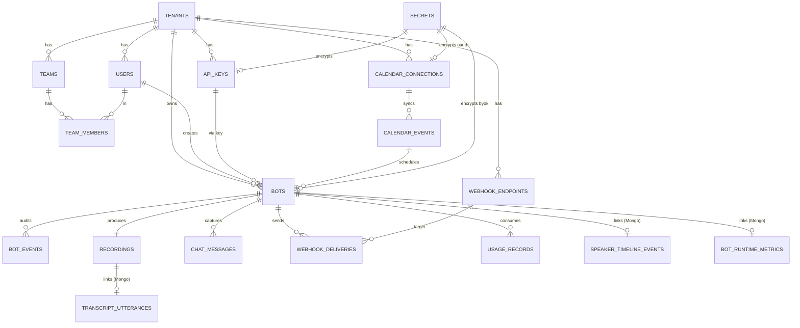

# Database Design — meet-bot-go

> Bản v1.0 · May 2026 · Áp dụng cho cả self-hosted single-tenant lẫn SaaS multi-tenant.
> Tham chiếu chính: [Meeting BaaS API v2](https://docs.meetingbaas.com), [docs/system-design.md](../../docs/system-design.md), [docs/implementation-plan.md](../../docs/implementation-plan.md).

Tài liệu này chỉ đặc tả **lớp dữ liệu**: Postgres (relational source of truth), MongoDB (high-volume time-series + document), Redis (cache + queue + dedup), S3 (artifact). Chi tiết business logic xem ở `docs/system-design.md`.

---

## Mục lục

1. [Requirements & Scale model](#1-requirements--scale-model)
2. [Storage taxonomy](#2-storage-taxonomy)
3. [Logical ERD](#3-logical-erd)
4. [Postgres schema (DDL chuẩn 3NF)](#4-postgres-schema-ddl-chuẩn-3nf)
5. [MongoDB collections](#5-mongodb-collections)
6. [Redis keyspace](#6-redis-keyspace)
7. [S3 layout](#7-s3-layout)
8. [Cross-cutting concerns](#8-cross-cutting-concerns)
9. [Scaling plan](#9-scaling-plan)
10. [Trade-offs & rủi ro](#10-trade-offs--rủi-ro)
11. [Migration & evolution](#11-migration--evolution)

---

## 1. Requirements & Scale model

### 1.1 Functional requirements (rút từ Meeting BaaS v2)

| Nhóm | Tính năng |
|---|---|
| **Bot lifecycle** | Immediate + scheduled (`join_at`); 9-state machine; pause/resume recording; force leave-bot; chat-message từ bot. |
| **Recording modes** | `speaker_view`, `gallery_view`, `audio_only`. |
| **Transcription** | Built-in (Gladia default) + BYOK (user-provided API key); raw provider response + standardized utterances; diarization JSONL. |
| **Streaming WS** | Output (Int16 PCM 24kHz); bidirectional input (Phase 5). |
| **Calendars** | Google + Outlook OAuth (BYOC); event sync; auto-schedule bot khi event có meeting URL. |
| **Webhooks** | Account-level (SVIX-style, signed); per-bot callbacks (`bot.completed`/`bot.failed`); auto-disable sau 5 ngày fail. |
| **Multi-tenancy** | Tenants → Teams → Members; API keys per tenant; quotas/billing (Stripe). |
| **Idempotency** | `Idempotency-Key` header; deduplication theo `meeting_url + join_at` khi `allow_multiple_bots=false`. |
| **Data retention** | Policy theo plan: 3 / 7 / 14 / 30 ngày; `DELETE /v2/bots/{id}/delete-data` chủ động. |
| **Audit & alerts** | Audit log mọi action; operational alerts (low tokens, webhook disabled, …). |
| **Artifacts** | Video MP4, audio FLAC, transcription JSON, raw transcription, diarization JSONL, chat messages JSON, screenshots; presigned URL 4 h. |

### 1.2 Non-functional & scale targets

Mục tiêu thiết kế cho cụm production lớn (đo theo Meeting BaaS scale):

| Metric | Target |
|---|---|
| Concurrent bots | 5 000 đồng thời (peak 10k giờ giao thoa) |
| Throughput tạo bot | 50 req/s sustained, 500 req/s burst |
| Bot tạo / ngày | 100 000 |
| Latency `POST /v2/bots` (P99) | < 250 ms |
| Latency `GET /v2/bots/{id}/status` (P99) | < 50 ms (Redis cache) |
| Latency dashboard list (P99) | < 800 ms |
| Webhook delivery success | ≥ 99.9 % within 5 min |
| Availability | 99.95 % control plane |

### 1.3 Volume estimates (per year @ 100k bots/day)

| Object | Avg/bot | Volume / day | Volume / year |
|---|---|---|---|
| `bots` rows | 1 | 100k | 36.5M |
| `bot_events` (state transitions + webhooks) | ~30 | 3M | 1.1B |
| `chat_messages` | ~50 | 5M | 1.8B |
| `webhook_deliveries` | ~6 | 600k | 220M |
| `usage_records` | ~3 | 300k | 110M |
| `audit_logs` | ~10 | 1M | 365M |
| `transcript_utterances` (Mongo) | ~600 | 60M | 22B |
| `speaker_timeline_events` (Mongo) | ~3 000 | 300M | 110B |
| `bot_runtime_metrics` (Mongo) | ~360 (1/s) | 36M | 13B |
| Artifacts (S3) MP4/audio/json | ~500 MB | 50 TB | 18 PB raw, ~3 PB sau retention |

**Hệ luỵ thiết kế** (driving design choices):

- Mọi bảng **append-only volume cao** trong Postgres phải **declarative partitioning by RANGE (created_at)** — partition tháng cho `bot_events`, `webhook_deliveries`, `audit_logs`, `usage_records`, `chat_messages`.
- Mọi collection **time-series** trong MongoDB phải dùng **time-series collection** (Mongo 5+) với `metaField=bot_id`, `granularity=seconds` (hoặc `minutes` cho metrics) + **sharding hash(bot_id)**.
- **Mọi truy cập đọc nóng** (status realtime, dedup, idempotency, rate limit) đi qua **Redis** thay vì Postgres.
- **Artifact ≥ 1 MB → S3** thuần, DB chỉ lưu key.

---

## 2. Storage taxonomy

Mỗi loại dữ liệu được phân loại theo **tính chất truy cập**, **cấu trúc**, **độ bền**, **volume**:

| Loại dữ liệu | Ví dụ | Đặc tính | Storage chọn | Lý do |
|---|---|---|---|---|
| Source of truth, transactional | `tenants`, `users`, `bots`, `recordings`, `webhook_endpoints`, `calendar_connections`, `api_keys`, `secrets` | ACID, low/medium volume, JOIN nhiều, FK constraint | **Postgres** | Strong consistency, FK integrity, RLS |
| Append-only audit | `bot_events`, `audit_logs`, `webhook_deliveries`, `usage_records`, `chat_messages` | Insert-heavy, time-range query, không update | **Postgres partitioned** | Vẫn cần JOIN với `bots`; partition + BRIN giữ chi phí storage thấp |
| Document, schema-flexible, large | `transcript_utterances`, `transcript_raw_provider`, `diarization_segments` | Schema khác theo provider, query by bot_id, full-text optional | **MongoDB** | Schema-less, sharding bot_id, Atlas Search nếu cần |
| Time-series throughput cao | `speaker_timeline_events`, `bot_runtime_metrics`, `audio_level_samples` | 1Hz–10Hz/bot, retention ngắn, downsample | **MongoDB time-series** | Native bucket + TTL, compression cao |
| Hot runtime cache + queue | `bot:state:<uuid>`, dedup, idempotency, rate limit, job queue | Sub-ms latency, ephemeral, atomic ops | **Redis** | Pub/sub + Streams + INCR + TTL |
| Bulk binary artifact | MP4, FLAC, WAV, screenshots, log archives | > 1 MB, write once | **S3** (MinIO/AWS) | DB chỉ lưu key |

**Quy tắc cứng**:
1. **Không** lưu BLOB > 1 MB trong Postgres hoặc Mongo.
2. **Không** dùng Mongo cho dữ liệu cần FK / strong consistency.
3. **Không** dùng Postgres làm cache nóng (status realtime đi Redis).
4. **Không** dùng Redis làm source of truth — mất data khi restart phải tái tạo từ PG/Mongo.

---

## 3. Logical ERD



> Note: ô màu xám (Mongo) không có FK thật — chỉ tham chiếu qua `bot_id` (UUID) và được orchestrate ở application layer.

---

## 4. Postgres schema (DDL chuẩn 3NF)

### 4.1 Quy ước chung

- **Naming**: snake_case; tên bảng số nhiều; `*_id` cho FK; `created_at`/`updated_at`/`deleted_at` mọi nơi cần audit; `*_at` luôn `TIMESTAMPTZ`.
- **PK**: UUID v7 (time-ordered) cho row tạo từ ngoài (`bots.id`, `bot_events.id`); `BIGSERIAL` cho hot-path internal (`webhook_deliveries.id`).
- **Soft delete**: `deleted_at TIMESTAMPTZ`; mọi index nóng có `WHERE deleted_at IS NULL` partial.
- **Multi-tenancy**: mọi bảng nghiệp vụ có `tenant_id UUID NOT NULL`; bảo vệ bằng **Row-Level Security** (RLS).
- **Partitioning**: bảng append-only volume cao dùng `PARTITION BY RANGE (created_at)`, partition theo tháng, tự động qua `pg_partman`.
- **Constraints**: CHECK enum (status), UNIQUE (idempotency, dedup), FK ON DELETE CASCADE/SET NULL chính xác.
- **Encryption**: secret material lưu ở bảng `secrets` riêng (envelope encryption KMS), bảng nghiệp vụ chỉ giữ `secret_id`.

### 4.2 Extensions cần bật

```sql
CREATE EXTENSION IF NOT EXISTS "uuid-ossp";   -- uuid_generate_v4
CREATE EXTENSION IF NOT EXISTS "pgcrypto";    -- gen_random_uuid + digest
CREATE EXTENSION IF NOT EXISTS "btree_gin";   -- GIN index combo
CREATE EXTENSION IF NOT EXISTS "citext";      -- email case-insensitive
CREATE EXTENSION IF NOT EXISTS "pg_trgm";     -- search bot_name LIKE
CREATE EXTENSION IF NOT EXISTS "pg_partman";  -- partition automation
-- Tùy chọn: CREATE EXTENSION timescaledb cho hyper-tables thay partitioning thủ công
```

### 4.3 Identity & access

```sql
-- 4.3.1 Tenants
CREATE TABLE tenants (
    id              UUID PRIMARY KEY DEFAULT gen_random_uuid(),
    name            VARCHAR(255) NOT NULL,
    slug            CITEXT NOT NULL UNIQUE,
    plan            VARCHAR(20) NOT NULL DEFAULT 'free'
                    CHECK (plan IN ('free','payg','pro','scale','enterprise')),
    retention_days  SMALLINT NOT NULL DEFAULT 7
                    CHECK (retention_days BETWEEN 1 AND 365),
    stripe_customer_id VARCHAR(64),
    settings        JSONB NOT NULL DEFAULT '{}'::jsonb,
    created_at      TIMESTAMPTZ NOT NULL DEFAULT NOW(),
    updated_at      TIMESTAMPTZ NOT NULL DEFAULT NOW(),
    deleted_at      TIMESTAMPTZ
);
CREATE INDEX idx_tenants_active ON tenants (created_at DESC) WHERE deleted_at IS NULL;

-- 4.3.2 Users
CREATE TABLE users (
    id              UUID PRIMARY KEY DEFAULT gen_random_uuid(),
    tenant_id       UUID NOT NULL REFERENCES tenants(id) ON DELETE CASCADE,
    email           CITEXT NOT NULL,
    password_hash   VARCHAR(255),                       -- argon2id; NULL nếu SSO-only
    full_name       VARCHAR(255),
    role            VARCHAR(20) NOT NULL DEFAULT 'member'
                    CHECK (role IN ('owner','admin','member','readonly')),
    last_login_at   TIMESTAMPTZ,
    created_at      TIMESTAMPTZ NOT NULL DEFAULT NOW(),
    updated_at      TIMESTAMPTZ NOT NULL DEFAULT NOW(),
    deleted_at      TIMESTAMPTZ,
    UNIQUE (tenant_id, email)
);
CREATE INDEX idx_users_tenant ON users (tenant_id) WHERE deleted_at IS NULL;

-- 4.3.3 Teams (sub-tenant grouping)
CREATE TABLE teams (
    id              UUID PRIMARY KEY DEFAULT gen_random_uuid(),
    tenant_id       UUID NOT NULL REFERENCES tenants(id) ON DELETE CASCADE,
    name            VARCHAR(255) NOT NULL,
    owner_user_id   UUID NOT NULL REFERENCES users(id) ON DELETE RESTRICT,
    created_at      TIMESTAMPTZ NOT NULL DEFAULT NOW(),
    deleted_at      TIMESTAMPTZ,
    UNIQUE (tenant_id, name)
);

CREATE TABLE team_members (
    team_id         UUID NOT NULL REFERENCES teams(id) ON DELETE CASCADE,
    user_id         UUID NOT NULL REFERENCES users(id) ON DELETE CASCADE,
    role            VARCHAR(20) NOT NULL DEFAULT 'member'
                    CHECK (role IN ('owner','admin','member','readonly')),
    created_at      TIMESTAMPTZ NOT NULL DEFAULT NOW(),
    PRIMARY KEY (team_id, user_id)
);
CREATE INDEX idx_team_members_user ON team_members (user_id);

-- 4.3.4 API keys (hashed; 3NF — key prefix tách riêng cho tra cứu)
CREATE TABLE api_keys (
    id              UUID PRIMARY KEY DEFAULT gen_random_uuid(),
    tenant_id       UUID NOT NULL REFERENCES tenants(id) ON DELETE CASCADE,
    created_by      UUID REFERENCES users(id) ON DELETE SET NULL,
    name            VARCHAR(120) NOT NULL,
    key_prefix      CHAR(8) NOT NULL,                 -- 8-ký tự đầu hiển thị UI
    key_hash        BYTEA NOT NULL,                   -- sha256(secret) — UNIQUE
    scopes          TEXT[] NOT NULL DEFAULT '{bots:write,bots:read}',
    rate_limit_per_min INTEGER NOT NULL DEFAULT 600,
    last_used_at    TIMESTAMPTZ,
    expires_at      TIMESTAMPTZ,
    revoked_at      TIMESTAMPTZ,
    created_at      TIMESTAMPTZ NOT NULL DEFAULT NOW(),
    UNIQUE (key_hash)
);
CREATE INDEX idx_api_keys_tenant_active ON api_keys (tenant_id)
    WHERE revoked_at IS NULL AND (expires_at IS NULL OR expires_at > NOW());
```

### 4.4 Secrets vault (envelope encryption)

```sql
-- 4.4 Mọi token nhạy cảm (OAuth refresh, BYOK API key, callback secret) lưu ở đây
-- ciphertext = AES-256-GCM(plaintext, DEK); DEK được wrap bằng KMS (AWS KMS / Vault).
CREATE TABLE secrets (
    id              UUID PRIMARY KEY DEFAULT gen_random_uuid(),
    tenant_id       UUID NOT NULL REFERENCES tenants(id) ON DELETE CASCADE,
    purpose         VARCHAR(40) NOT NULL
                    CHECK (purpose IN ('oauth_refresh','transcription_byok',
                                       'webhook_callback','streaming_auth','generic')),
    kms_key_id      VARCHAR(255) NOT NULL,
    ciphertext      BYTEA NOT NULL,
    nonce           BYTEA NOT NULL,
    rotated_from    UUID REFERENCES secrets(id) ON DELETE SET NULL,
    created_at      TIMESTAMPTZ NOT NULL DEFAULT NOW(),
    rotated_at      TIMESTAMPTZ,
    deleted_at      TIMESTAMPTZ
);
CREATE INDEX idx_secrets_tenant ON secrets (tenant_id, purpose) WHERE deleted_at IS NULL;
```

### 4.5 Bots (entity chính)

```sql
-- 4.5 Reference enum bằng bảng tra cứu để dễ bổ sung mã mới (avoid ALTER TYPE)
CREATE TABLE bot_status_codes (
    code            VARCHAR(40) PRIMARY KEY,
    is_terminal     BOOLEAN NOT NULL DEFAULT FALSE,
    description     TEXT
);
INSERT INTO bot_status_codes(code, is_terminal, description) VALUES
    ('queued',                FALSE, 'Job created, waiting for dispatch'),
    ('scheduled',             FALSE, 'Awaiting join_at'),
    ('joining_call',          FALSE, 'Bot is connecting'),
    ('in_waiting_room',       FALSE, 'Bot in lobby, awaiting host'),
    ('in_call_not_recording', FALSE, 'Joined, recording not started yet'),
    ('in_call_recording',     FALSE, 'Actively recording'),
    ('recording_paused',      FALSE, 'Paused by API'),
    ('recording_resumed',     FALSE, 'Resumed after pause'),
    ('call_ended',            FALSE, 'Bot left, processing'),
    ('completed',             TRUE,  'Artifacts finalized'),
    ('failed',                TRUE,  'Terminal error'),
    ('cancelled',             TRUE,  'User cancelled before join');

CREATE TABLE bots (
    id                  UUID PRIMARY KEY DEFAULT gen_random_uuid(),
    tenant_id           UUID NOT NULL REFERENCES tenants(id) ON DELETE CASCADE,
    created_by_user_id  UUID REFERENCES users(id) ON DELETE SET NULL,
    api_key_id          UUID REFERENCES api_keys(id) ON DELETE SET NULL,
    team_id             UUID REFERENCES teams(id) ON DELETE SET NULL,

    -- External identity (idempotency boundary)
    idempotency_key     VARCHAR(255),
    deduplication_hash  CHAR(64),                                -- sha256(meeting_url||join_at_minute)
    parent_event_id     UUID REFERENCES calendar_events(id) ON DELETE SET NULL,

    -- Meeting target
    meeting_url         TEXT NOT NULL,
    meeting_provider    VARCHAR(20) NOT NULL
                        CHECK (meeting_provider IN ('Meet','Teams','Zoom')),
    meeting_id          VARCHAR(255),

    -- Bot config
    bot_name            VARCHAR(255) NOT NULL,
    bot_image_url       TEXT,
    entry_message       TEXT,
    recording_mode      VARCHAR(20) NOT NULL DEFAULT 'speaker_view'
                        CHECK (recording_mode IN ('speaker_view','gallery_view','audio_only')),
    allow_multiple_bots BOOLEAN NOT NULL DEFAULT TRUE,
    extra               JSONB NOT NULL DEFAULT '{}'::jsonb,

    -- Transcription
    transcription_enabled  BOOLEAN NOT NULL DEFAULT FALSE,
    transcription_provider VARCHAR(40),                          -- 'gladia','deepgram','assembly',...
    transcription_byok_secret_id UUID REFERENCES secrets(id) ON DELETE SET NULL,

    -- Streaming
    streaming_enabled   BOOLEAN NOT NULL DEFAULT FALSE,
    streaming_input_url TEXT,
    streaming_output_url TEXT,
    streaming_audio_frequency INTEGER CHECK (streaming_audio_frequency IN (16000,24000,48000)),

    -- Scheduling
    join_at             TIMESTAMPTZ,                             -- NULL = immediate

    -- Timeouts
    waiting_room_timeout_s   INTEGER NOT NULL DEFAULT 600
                             CHECK (waiting_room_timeout_s BETWEEN 120 AND 1800),
    no_one_joined_timeout_s  INTEGER NOT NULL DEFAULT 600
                             CHECK (no_one_joined_timeout_s BETWEEN 120 AND 1800),
    silence_timeout_s        INTEGER NOT NULL DEFAULT 600
                             CHECK (silence_timeout_s BETWEEN 300 AND 1800),

    -- Webhook routing
    webhook_endpoint_id UUID REFERENCES webhook_endpoints(id) ON DELETE SET NULL,
    callback_url        TEXT,                                    -- per-bot callback
    callback_secret_id  UUID REFERENCES secrets(id) ON DELETE SET NULL,

    -- Lifecycle
    status              VARCHAR(40) NOT NULL DEFAULT 'queued'
                        REFERENCES bot_status_codes(code),
    end_reason          VARCHAR(50),
    error_code          VARCHAR(50),                             -- BOT_NOT_ACCEPTED, TIMEOUT_..., INSUFFICIENT_TOKENS
    error_message       TEXT,
    retry_count         SMALLINT NOT NULL DEFAULT 0
                        CHECK (retry_count BETWEEN 0 AND 5),

    -- Timing
    created_at          TIMESTAMPTZ NOT NULL DEFAULT NOW(),
    updated_at          TIMESTAMPTZ NOT NULL DEFAULT NOW(),
    queued_at           TIMESTAMPTZ NOT NULL DEFAULT NOW(),
    started_at          TIMESTAMPTZ,
    joined_at           TIMESTAMPTZ,
    recording_started_at TIMESTAMPTZ,
    recording_ended_at  TIMESTAMPTZ,
    ended_at            TIMESTAMPTZ,

    -- Cost
    duration_seconds    INTEGER GENERATED ALWAYS AS
        (EXTRACT(EPOCH FROM (recording_ended_at - recording_started_at))::INT) STORED,
    token_cost          INTEGER NOT NULL DEFAULT 0,

    -- Soft delete (data retention)
    data_deleted_at     TIMESTAMPTZ,                             -- artifacts purged
    deleted_at          TIMESTAMPTZ,                             -- row hidden

    UNIQUE (tenant_id, idempotency_key) DEFERRABLE INITIALLY DEFERRED
);

-- Indexes hot-path
CREATE INDEX idx_bots_tenant_created ON bots (tenant_id, created_at DESC) WHERE deleted_at IS NULL;
CREATE INDEX idx_bots_tenant_status  ON bots (tenant_id, status, created_at DESC)
    WHERE deleted_at IS NULL AND status IN ('queued','scheduled','joining_call','in_waiting_room','in_call_recording','recording_paused');
CREATE INDEX idx_bots_join_at        ON bots (join_at) WHERE status = 'scheduled';
CREATE INDEX idx_bots_dedup          ON bots (tenant_id, deduplication_hash)
    WHERE allow_multiple_bots = FALSE AND deleted_at IS NULL;
CREATE INDEX idx_bots_extra_gin      ON bots USING GIN (extra jsonb_path_ops);
CREATE INDEX idx_bots_calendar_event ON bots (parent_event_id) WHERE parent_event_id IS NOT NULL;
```

### 4.6 Append-only audit (partitioned)

```sql
-- 4.6.1 bot_events — partition theo tháng
CREATE TABLE bot_events (
    id          BIGINT GENERATED ALWAYS AS IDENTITY,
    bot_id      UUID NOT NULL,
    tenant_id   UUID NOT NULL,
    code        VARCHAR(60) NOT NULL,            -- joining_call, in_waiting_room, recording_started, ...
    payload     JSONB NOT NULL DEFAULT '{}'::jsonb,
    sequence_no BIGINT NOT NULL,                 -- monotonic per bot (assigned by app)
    created_at  TIMESTAMPTZ NOT NULL DEFAULT NOW(),
    PRIMARY KEY (id, created_at)
) PARTITION BY RANGE (created_at);

-- Tự động tạo partition tháng 12 tháng tới qua pg_partman.
SELECT partman.create_parent('public.bot_events', 'created_at', 'native', 'monthly',
                             p_premake => 12);

CREATE INDEX idx_bot_events_bot_created ON bot_events (bot_id, created_at);
CREATE INDEX idx_bot_events_tenant_code_brin ON bot_events USING BRIN (tenant_id, created_at);
CREATE UNIQUE INDEX uq_bot_events_seq ON bot_events (bot_id, sequence_no, created_at);

-- 4.6.2 webhook_endpoints
CREATE TABLE webhook_endpoints (
    id              UUID PRIMARY KEY DEFAULT gen_random_uuid(),
    tenant_id       UUID NOT NULL REFERENCES tenants(id) ON DELETE CASCADE,
    url             TEXT NOT NULL,
    secret_id       UUID REFERENCES secrets(id) ON DELETE SET NULL,
    event_filter    TEXT[] NOT NULL DEFAULT '{*}',                -- '*'=all
    is_active       BOOLEAN NOT NULL DEFAULT TRUE,
    consecutive_failures INTEGER NOT NULL DEFAULT 0,
    disabled_at     TIMESTAMPTZ,                                  -- after 5d failure
    created_at      TIMESTAMPTZ NOT NULL DEFAULT NOW(),
    deleted_at      TIMESTAMPTZ,
    UNIQUE (tenant_id, url)
);
CREATE INDEX idx_webhook_endpoints_active ON webhook_endpoints (tenant_id) WHERE is_active AND deleted_at IS NULL;

-- 4.6.3 webhook_deliveries — partitioned by created_at
CREATE TABLE webhook_deliveries (
    id              BIGINT GENERATED ALWAYS AS IDENTITY,
    endpoint_id     UUID NOT NULL,
    bot_id          UUID,                                -- NULL cho calendar webhooks
    event_code      VARCHAR(60) NOT NULL,
    payload         JSONB NOT NULL,
    attempt         SMALLINT NOT NULL DEFAULT 1,
    status_code     INTEGER,
    response_body   TEXT,                                -- truncate 4 KB
    error           TEXT,
    next_retry_at   TIMESTAMPTZ,
    succeeded_at    TIMESTAMPTZ,
    failed_permanently_at TIMESTAMPTZ,
    created_at      TIMESTAMPTZ NOT NULL DEFAULT NOW(),
    PRIMARY KEY (id, created_at)
) PARTITION BY RANGE (created_at);
SELECT partman.create_parent('public.webhook_deliveries', 'created_at', 'native', 'monthly', p_premake => 6);

CREATE INDEX idx_wh_deliveries_pending ON webhook_deliveries (next_retry_at)
    WHERE succeeded_at IS NULL AND failed_permanently_at IS NULL;
CREATE INDEX idx_wh_deliveries_bot ON webhook_deliveries (bot_id, created_at);

-- 4.6.4 webhook_event_outbox — outbox pattern (transactional dual-write)
CREATE TABLE webhook_event_outbox (
    id          BIGINT GENERATED ALWAYS AS IDENTITY,
    tenant_id   UUID NOT NULL,
    bot_id      UUID,
    event_code  VARCHAR(60) NOT NULL,
    payload     JSONB NOT NULL,
    processed_at TIMESTAMPTZ,
    created_at  TIMESTAMPTZ NOT NULL DEFAULT NOW(),
    PRIMARY KEY (id, created_at)
) PARTITION BY RANGE (created_at);
SELECT partman.create_parent('public.webhook_event_outbox', 'created_at', 'native', 'daily', p_premake => 7);
CREATE INDEX idx_outbox_unprocessed ON webhook_event_outbox (created_at) WHERE processed_at IS NULL;
```

### 4.7 Recordings & chat

```sql
-- 4.7.1 recordings — 1:1 với bots, lưu metadata + S3 keys (artifact lưu trên S3)
CREATE TABLE recordings (
    bot_id              UUID PRIMARY KEY REFERENCES bots(id) ON DELETE CASCADE,
    tenant_id           UUID NOT NULL,
    mp4_s3_key          TEXT,
    flac_s3_key         TEXT,
    wav_s3_key          TEXT,                          -- mono 16kHz cho STT
    transcription_s3_key TEXT,
    raw_transcription_s3_key TEXT,
    diarization_s3_key  TEXT,
    chat_messages_s3_key TEXT,
    screenshots_s3_prefix TEXT,
    logs_s3_key         TEXT,
    duration_seconds    INTEGER,
    mp4_bytes           BIGINT,
    flac_bytes          BIGINT,
    av_offset_ms        INTEGER,                       -- từ CalculVideoOffset
    finalized_at        TIMESTAMPTZ,
    expires_at          TIMESTAMPTZ                    -- = finalized_at + tenant.retention_days
);
CREATE INDEX idx_recordings_expiry ON recordings (expires_at) WHERE expires_at IS NOT NULL;

-- 4.7.2 chat_messages (volume cao → partitioned)
CREATE TABLE chat_messages (
    id              BIGINT GENERATED ALWAYS AS IDENTITY,
    bot_id          UUID NOT NULL,
    tenant_id       UUID NOT NULL,
    sender_name     VARCHAR(255) NOT NULL,
    sender_id       VARCHAR(255),
    sender_type     VARCHAR(20) NOT NULL DEFAULT 'participant'
                    CHECK (sender_type IN ('host','participant','bot')),
    text            TEXT NOT NULL,
    sent_at         TIMESTAMPTZ NOT NULL,              -- timestamp tại meeting (clock)
    sequence_no     INTEGER NOT NULL,                  -- thứ tự trong meeting
    created_at      TIMESTAMPTZ NOT NULL DEFAULT NOW(),
    PRIMARY KEY (id, created_at)
) PARTITION BY RANGE (created_at);
SELECT partman.create_parent('public.chat_messages', 'created_at', 'native', 'monthly', p_premake => 6);
CREATE INDEX idx_chat_bot ON chat_messages (bot_id, sent_at);
```

### 4.8 Calendars

```sql
-- 4.8.1 calendar_connections (BYOC OAuth)
CREATE TABLE calendar_connections (
    id              UUID PRIMARY KEY DEFAULT gen_random_uuid(),
    tenant_id       UUID NOT NULL REFERENCES tenants(id) ON DELETE CASCADE,
    user_id         UUID REFERENCES users(id) ON DELETE SET NULL,
    provider        VARCHAR(20) NOT NULL CHECK (provider IN ('google','outlook')),
    account_email   CITEXT NOT NULL,
    oauth_refresh_secret_id UUID NOT NULL REFERENCES secrets(id),
    oauth_client_id VARCHAR(255) NOT NULL,
    oauth_client_secret_id  UUID NOT NULL REFERENCES secrets(id),
    status          VARCHAR(20) NOT NULL DEFAULT 'active'
                    CHECK (status IN ('active','expired','revoked')),
    last_sync_at    TIMESTAMPTZ,
    sync_cursor     TEXT,                              -- provider opaque cursor
    created_at      TIMESTAMPTZ NOT NULL DEFAULT NOW(),
    deleted_at      TIMESTAMPTZ,
    UNIQUE (tenant_id, provider, account_email)
);

-- 4.8.2 calendar_events (synced from provider)
CREATE TABLE calendar_events (
    id              UUID PRIMARY KEY DEFAULT gen_random_uuid(),
    connection_id   UUID NOT NULL REFERENCES calendar_connections(id) ON DELETE CASCADE,
    tenant_id       UUID NOT NULL,
    provider_event_id VARCHAR(512) NOT NULL,
    title           TEXT,
    description     TEXT,
    meeting_url     TEXT,                              -- extracted nếu có
    meeting_provider VARCHAR(20),
    start_at        TIMESTAMPTZ NOT NULL,
    end_at          TIMESTAMPTZ NOT NULL,
    organizer_email CITEXT,
    attendees       JSONB NOT NULL DEFAULT '[]'::jsonb, -- [{email,name,response}]
    raw             JSONB NOT NULL,                    -- full provider payload
    last_synced_at  TIMESTAMPTZ NOT NULL DEFAULT NOW(),
    deleted_at      TIMESTAMPTZ,                       -- provider 'cancelled'
    UNIQUE (connection_id, provider_event_id)
);
CREATE INDEX idx_cal_events_tenant_window
    ON calendar_events (tenant_id, start_at)
    WHERE deleted_at IS NULL AND meeting_url IS NOT NULL;
CREATE INDEX idx_cal_events_organizer ON calendar_events (tenant_id, organizer_email);
```

### 4.9 Usage / billing / audit / alerts

```sql
-- 4.9.1 usage_records — partitioned, 1 row mỗi unit tiêu thụ (token, minute, GB-storage)
CREATE TABLE usage_records (
    id              BIGINT GENERATED ALWAYS AS IDENTITY,
    tenant_id       UUID NOT NULL,
    bot_id          UUID,                              -- NULL cho usage không gắn bot (storage)
    kind            VARCHAR(20) NOT NULL
                    CHECK (kind IN ('token','minute','gb_storage','transcription_min')),
    amount          NUMERIC(12,4) NOT NULL,
    unit_cost_cents NUMERIC(12,4),
    total_cents     NUMERIC(14,4),
    recorded_at     TIMESTAMPTZ NOT NULL DEFAULT NOW(),
    PRIMARY KEY (id, recorded_at)
) PARTITION BY RANGE (recorded_at);
SELECT partman.create_parent('public.usage_records', 'recorded_at', 'native', 'monthly', p_premake => 12);
CREATE INDEX idx_usage_tenant_time ON usage_records (tenant_id, recorded_at);

-- 4.9.2 billing_invoices
CREATE TABLE billing_invoices (
    id              UUID PRIMARY KEY DEFAULT gen_random_uuid(),
    tenant_id       UUID NOT NULL REFERENCES tenants(id) ON DELETE RESTRICT,
    period_start    DATE NOT NULL,
    period_end      DATE NOT NULL,
    total_tokens    BIGINT NOT NULL DEFAULT 0,
    total_cents     NUMERIC(14,2) NOT NULL DEFAULT 0,
    currency        CHAR(3) NOT NULL DEFAULT 'USD',
    stripe_invoice_id VARCHAR(64),
    status          VARCHAR(20) NOT NULL DEFAULT 'draft'
                    CHECK (status IN ('draft','open','paid','void','uncollectible')),
    issued_at       TIMESTAMPTZ,
    paid_at         TIMESTAMPTZ,
    UNIQUE (tenant_id, period_start, period_end)
);

-- 4.9.3 audit_logs — partitioned, append-only
CREATE TABLE audit_logs (
    id              BIGINT GENERATED ALWAYS AS IDENTITY,
    tenant_id       UUID NOT NULL,
    actor_user_id   UUID,
    actor_api_key_id UUID,
    action          VARCHAR(60) NOT NULL,             -- bot.create, bot.cancel, calendar.connect, ...
    target_type     VARCHAR(40),
    target_id       VARCHAR(64),
    ip              INET,
    user_agent      TEXT,
    metadata        JSONB NOT NULL DEFAULT '{}'::jsonb,
    created_at      TIMESTAMPTZ NOT NULL DEFAULT NOW(),
    PRIMARY KEY (id, created_at)
) PARTITION BY RANGE (created_at);
SELECT partman.create_parent('public.audit_logs', 'created_at', 'native', 'monthly', p_premake => 12);
CREATE INDEX idx_audit_tenant_action ON audit_logs (tenant_id, action, created_at);

-- 4.9.4 alerts (operational, surfaced ở /v2/alerts)
CREATE TABLE alerts (
    id              UUID PRIMARY KEY DEFAULT gen_random_uuid(),
    tenant_id       UUID NOT NULL REFERENCES tenants(id) ON DELETE CASCADE,
    code            VARCHAR(40) NOT NULL,             -- LOW_TOKEN_BALANCE, WEBHOOK_DISABLED,...
    severity        VARCHAR(10) NOT NULL DEFAULT 'warn'
                    CHECK (severity IN ('info','warn','error','critical')),
    message         TEXT NOT NULL,
    metadata        JSONB NOT NULL DEFAULT '{}'::jsonb,
    created_at      TIMESTAMPTZ NOT NULL DEFAULT NOW(),
    resolved_at     TIMESTAMPTZ
);
CREATE INDEX idx_alerts_open ON alerts (tenant_id, severity, created_at DESC) WHERE resolved_at IS NULL;
```

### 4.10 Idempotency & data retention housekeeping

```sql
-- 4.10.1 idempotency_keys — short-lived, scoped per tenant
CREATE TABLE idempotency_keys (
    tenant_id       UUID NOT NULL,
    key             VARCHAR(255) NOT NULL,
    request_hash    BYTEA NOT NULL,                  -- sha256(method+path+body) để detect mismatch
    response_status SMALLINT,
    response_body   JSONB,
    created_at      TIMESTAMPTZ NOT NULL DEFAULT NOW(),
    expires_at      TIMESTAMPTZ NOT NULL DEFAULT NOW() + INTERVAL '24 hours',
    PRIMARY KEY (tenant_id, key)
);
CREATE INDEX idx_idem_expiry ON idempotency_keys (expires_at);
-- Cron pg_cron mỗi 10 phút:
--   DELETE FROM idempotency_keys WHERE expires_at < NOW();

-- 4.10.2 data_retention_jobs — cron worker bốc job → xóa S3 + flag bots.data_deleted_at
CREATE TABLE data_retention_jobs (
    id              UUID PRIMARY KEY DEFAULT gen_random_uuid(),
    tenant_id       UUID NOT NULL,
    bot_id          UUID NOT NULL,
    scheduled_at    TIMESTAMPTZ NOT NULL,
    started_at      TIMESTAMPTZ,
    completed_at    TIMESTAMPTZ,
    status          VARCHAR(20) NOT NULL DEFAULT 'pending'
                    CHECK (status IN ('pending','running','done','failed')),
    error           TEXT
);
CREATE INDEX idx_retention_due ON data_retention_jobs (scheduled_at)
    WHERE status = 'pending';
```

### 4.11 Row-Level Security (multi-tenant isolation)

```sql
-- Bật RLS trên mọi bảng nghiệp vụ
ALTER TABLE bots ENABLE ROW LEVEL SECURITY;
ALTER TABLE bot_events ENABLE ROW LEVEL SECURITY;
ALTER TABLE recordings ENABLE ROW LEVEL SECURITY;
-- ... tương tự cho mọi bảng có tenant_id

-- Policy mặc định: chỉ thấy row có tenant_id = current_setting('app.tenant_id')
CREATE POLICY tenant_isolation_bots ON bots
    USING (tenant_id::text = current_setting('app.tenant_id', true));

-- API server set GUC mỗi request:
--   SET LOCAL app.tenant_id = '<uuid>';
-- Job background dùng vai trò siêu người dùng (BYPASSRLS) cho consolidation jobs.
```

### 4.12 Triggers cần thiết

```sql
-- updated_at auto bump
CREATE OR REPLACE FUNCTION trg_set_updated_at() RETURNS TRIGGER AS $$
BEGIN NEW.updated_at = NOW(); RETURN NEW; END;
$$ LANGUAGE plpgsql;

CREATE TRIGGER bots_updated_at BEFORE UPDATE ON bots
    FOR EACH ROW EXECUTE FUNCTION trg_set_updated_at();
-- ... áp cho tenants, users, teams, calendar_connections

-- Schedule retention job khi recordings.finalized_at được set
CREATE OR REPLACE FUNCTION trg_schedule_retention() RETURNS TRIGGER AS $$
DECLARE retention SMALLINT;
BEGIN
    IF NEW.finalized_at IS NOT NULL AND OLD.finalized_at IS NULL THEN
        SELECT t.retention_days INTO retention
            FROM tenants t WHERE t.id = NEW.tenant_id;
        NEW.expires_at := NEW.finalized_at + make_interval(days => retention);
        INSERT INTO data_retention_jobs(tenant_id, bot_id, scheduled_at)
            VALUES (NEW.tenant_id, NEW.bot_id, NEW.expires_at);
    END IF;
    RETURN NEW;
END;
$$ LANGUAGE plpgsql;

CREATE TRIGGER recordings_schedule_retention BEFORE UPDATE ON recordings
    FOR EACH ROW EXECUTE FUNCTION trg_schedule_retention();
```

---

## 5. MongoDB collections

MongoDB chỉ phục vụ 4 nhóm dữ liệu **volume cực cao, schema biến đổi, ít cần JOIN**:

### 5.1 `transcript_utterances`

Schema chuẩn hoá từ output Gladia/Deepgram/Assembly. Một utterance = một câu/chunk speaker.

```json
{
  "_id": "ObjectId(...)",
  "bot_id": "<UUID>",
  "tenant_id": "<UUID>",
  "sequence_no": 142,
  "text": "Hi everyone, let's get started.",
  "start_ms": 152340,
  "end_ms": 154820,
  "speaker_id": "spk_2",
  "speaker_name": "Alice Doe",
  "language": "en-US",
  "confidence": 0.94,
  "words": [
    { "text": "Hi",        "start_ms": 152340, "end_ms": 152540, "confidence": 0.99 },
    { "text": "everyone,", "start_ms": 152540, "end_ms": 153010, "confidence": 0.97 }
  ],
  "provider": "gladia",
  "created_at": ISODate("2026-05-11T01:30:00Z")
}
```

**Indexes**:

```javascript
db.transcript_utterances.createIndex({ bot_id: 1, start_ms: 1 });
db.transcript_utterances.createIndex({ bot_id: 1, speaker_id: 1, start_ms: 1 });
db.transcript_utterances.createIndex({ tenant_id: 1, created_at: 1 });
db.transcript_utterances.createIndex(
    { text: "text" },
    { default_language: "english", weights: { text: 10 } }
);
```

**Sharding**: hash on `bot_id` (mọi query thường có `bot_id` filter) — phân tán đều.

```javascript
sh.shardCollection("meetbot.transcript_utterances", { bot_id: "hashed" });
```

**Retention TTL**: theo `tenant.retention_days` — vì TTL collection-level đồng đều không phù hợp multi-tenant, dùng cron job application đọc `data_retention_jobs` rồi `deleteMany({bot_id})`.

### 5.2 `transcript_raw_provider`

Lưu **nguyên vẹn** response từ provider để re-process / debug. Schema khác hẳn theo provider.

```json
{
  "_id": "ObjectId(...)",
  "bot_id": "<UUID>",
  "tenant_id": "<UUID>",
  "provider": "gladia",
  "provider_request_id": "gld_xyz",
  "received_at": ISODate("..."),
  "raw": { /* full JSON từ provider, có thể MB */ }
}
```

**Indexes**: `{bot_id: 1, provider: 1}` (unique). Single doc / bot / provider.

### 5.3 `speaker_timeline_events` (time-series)

Mỗi sự kiện đổi trạng thái speaker (1–10 Hz). Dùng **MongoDB time-series collection**:

```javascript
db.createCollection("speaker_timeline_events", {
  timeseries: {
    timeField: "ts",
    metaField: "bot_id",
    granularity: "seconds"
  },
  expireAfterSeconds: 60 * 60 * 24 * 30   // 30 ngày max; cron hạ thấp theo plan
});

db.speaker_timeline_events.createIndex({ bot_id: 1, ts: 1 });
sh.shardCollection("meetbot.speaker_timeline_events", { bot_id: "hashed" });
```

Document mẫu:
```json
{
  "ts": ISODate("2026-05-11T01:30:00.250Z"),
  "bot_id": "<UUID>",
  "speakers": [
    { "id": 1, "name": "Alice", "is_speaking": true,  "audio_level": 0.72 },
    { "id": 2, "name": "Bob",   "is_speaking": false, "audio_level": 0.00 }
  ]
}
```

### 5.4 `bot_runtime_metrics` (time-series)

Health/performance per bot, 1 Hz. Cùng pattern time-series collection, `granularity: "minutes"` để bucket lớn hơn (compression > 90 %).

```javascript
db.createCollection("bot_runtime_metrics", {
  timeseries: { timeField: "ts", metaField: "bot_id", granularity: "minutes" },
  expireAfterSeconds: 60 * 60 * 24 * 14
});
```

### 5.5 `screenshots` (manifest, file ở S3)

```javascript
db.screenshots.createIndex({ bot_id: 1, ts: 1 });
sh.shardCollection("meetbot.screenshots", { bot_id: "hashed" });
```

Document:
```json
{
  "_id": "ObjectId(...)",
  "bot_id": "<UUID>",
  "ts": ISODate("..."),
  "s3_key": "tenant1/bot-uuid/screenshots/000142.jpg",
  "size_bytes": 184320,
  "ocr_text": null            // optional, populated by background OCR
}
```

### 5.6 Tại sao **không** dùng Mongo cho các bảng PG bên trên

- `bots`, `webhook_endpoints`, `calendar_connections`: cần FK + ACID + RLS multi-tenant.
- `bot_events`: cần JOIN trong query "list bots with last_event_code"; partitioning Postgres đủ scale.
- `audit_logs`: yêu cầu pháp lý → ưu tiên Postgres (transactional với hành động chính).

---

## 6. Redis keyspace

Mọi key đều có **prefix định danh** + TTL nếu phù hợp. Dùng RESP3 + cluster mode để horizontal scale.

| Key pattern | Type | TTL | Mục đích |
|---|---|---|---|
| `bots:jobs` | Stream | persistent | Queue chính, consumer group `controller` |
| `bots:jobs:dlq` | Stream | persistent | Dead-letter sau N retries |
| `bot:state:{bot_uuid}` | Hash | 30 s | `current_state`, `last_heartbeat`, `attendees` — đọc cho `GET /status` |
| `bot:stop:{bot_uuid}` | Pub/Sub channel | n/a | `PUBLISH` lệnh stop từ api-server → bot-worker |
| `dedup:{tenant_id}:{sha256(meeting_url+join_at_minute)}` | String (`bot_id`) | 1 h | Chặn duplicate khi `allow_multiple_bots=false` |
| `idempotency:{tenant_id}:{key}` | String (response JSON) | 24 h | Phản hồi đã ghi nhận → trả lại nguyên |
| `rate:{api_key_id}:{minute_window}` | String INCR | 60 s | Rate limit per API key |
| `tokens:balance:{tenant_id}` | String INCR | persistent | Atomic decrement khi tạo bot, rollback nếu fail |
| `webhook:cb:{bot_id}` | Hash | until completed | Buffer event chờ delivery worker (outbox replica) |
| `lock:retention:{bot_id}` | String NX | 5 m | Mutex cho cron retention worker |

**Quy tắc**:
- Mọi command từ api-server đi qua **Lua script** hoặc **MULTI/EXEC** để giữ atomicity (vd: dedup + tạo bot row PG là **2-phase**: PG transaction → SET NX Redis sau khi commit thành công).
- Stop signal = **pub/sub** thay vì stream để latency < 100 ms (acceptable mất signal nếu bot-worker down → fallback poll DB mỗi 10 s).

---

## 7. S3 layout

```
s3://meetbot-recordings/
└── {tenant_id}/
    └── {bot_id}/
        ├── raw.mp4                 # ffmpeg uncut
        ├── output.mp4              # +faststart, đã apply offset
        ├── audio.flac              # FLAC mono 48kHz
        ├── audio.wav               # WAV mono 16kHz (cho STT)
        ├── transcription.json      # standardized utterances
        ├── transcription.raw.json  # provider raw (cũng lưu Mongo)
        ├── diarization.jsonl
        ├── chat_messages.json
        ├── screenshots/
        │   ├── 000001.jpg
        │   └── 000142.jpg
        └── logs/
            └── bot-worker.log.gz
```

**Bucket policies**:
- Versioning **on** + lifecycle rule `expires_at` (đọc từ recordings.expires_at — sync qua tag `tenant-retention`).
- Server-side encryption **SSE-KMS** với key per tenant cho enterprise plan.
- Presigned URL TTL 4 h (match Meeting BaaS API contract).
- CORS: cho phép GET từ dashboard origin.
- Multipart upload cho file > 100 MB (worker dùng `aws-sdk-go-v2 manager.NewUploader`).

---

## 8. Cross-cutting concerns

### 8.1 Multi-tenancy

- **Hard tenant scoping**: mọi bảng nghiệp vụ có `tenant_id NOT NULL`; mọi query bắt buộc filter qua RLS (`SET LOCAL app.tenant_id`).
- **API**: middleware api-server resolve API key → tenant_id → set GUC; ngăn lệch tenant.
- **Mongo**: filter `tenant_id` ở application layer (driver) + index hỗ trợ.
- **Redis**: prefix `{tenant_id}:` mọi key tiêu thụ — tránh enum tenant qua KEYS.

### 8.2 Encryption at rest

- **Postgres**: PG TDE (Postgres EE / RDS) hoặc volume-level (LUKS).
- **Field-level**: OAuth tokens, BYOK API key, callback secret → bảng `secrets` envelope encryption AES-256-GCM, DEK wrap qua AWS KMS / HashiCorp Vault. Code Go: `crypto/aes` + `crypto/cipher`.
- **S3**: SSE-KMS, key per tenant cho enterprise.
- **Mongo**: Client-Side Field-Level Encryption (CSFLE) cho `transcript_raw_provider.raw` nếu chứa PII.

### 8.3 Idempotency (`Idempotency-Key`)

```
1. api-server nhận POST /v2/bots với header Idempotency-Key=K
2. INSERT INTO idempotency_keys VALUES (tenant, K, hash(body), NULL, NULL) ON CONFLICT DO NOTHING
3. Nếu conflict → SELECT response_body — trả lại
4. Nếu insert mới → tạo bot, sau đó UPDATE response cho key
```
TTL 24 h là hợp lý theo công ước Stripe/Square.

### 8.4 Deduplication (`allow_multiple_bots=false`)

```
deduplication_hash = sha256(meeting_url || floor(coalesce(join_at, now()) / 60s))
```
Lưu vào `bots.deduplication_hash`; Redis `dedup:{tenant}:{hash}` SET NX (1h TTL) là fast-path; nếu Redis miss còn DB constraint backstop (`UNIQUE INDEX … WHERE allow_multiple_bots=false`).

### 8.5 Outbox pattern (tránh mất webhook event)

```
BEGIN;
  UPDATE bots SET status='completed' WHERE id=$1;
  INSERT INTO bot_events(...) VALUES (...);
  INSERT INTO webhook_event_outbox(...) VALUES (...);
COMMIT;
```
Worker poll `webhook_event_outbox WHERE processed_at IS NULL ORDER BY created_at LIMIT 500 FOR UPDATE SKIP LOCKED;` rồi push qua HTTP (hoặc SVIX) → mark `processed_at`. Đảm bảo at-least-once delivery; idempotency key client-side (`event_uuid`).

### 8.6 Data retention

- Trigger `recordings_schedule_retention` (xem 4.12) tự nhét row vào `data_retention_jobs`.
- Cron worker chạy mỗi giờ:
  - `SELECT … WHERE status='pending' AND scheduled_at <= NOW() FOR UPDATE SKIP LOCKED;`
  - Xóa S3 prefix `{tenant_id}/{bot_id}/`.
  - `DELETE` Mongo theo `bot_id`.
  - `UPDATE bots SET data_deleted_at=NOW()`.
  - Mark `data_retention_jobs.status='done'`.
- API `DELETE /v2/bots/{id}/delete-data` chỉ tạo job với `scheduled_at=NOW()`.

### 8.7 Soft delete vs hard delete

- **Soft**: `deleted_at` cho row business (bots, users, …) — hiển thị tuỳ flag.
- **Hard**: `bot_events`, `webhook_deliveries`, `audit_logs` không bao giờ xóa hàng — thay bằng **drop partition** ≥ 13 tháng.

### 8.8 Connection pooling

- Postgres: **PgBouncer** transaction-pooling — pool size = `max_connections * 0.8 / replicas`.
- Mongo: SDK pool 100/instance.
- Redis: cluster client + 50 conn/instance.

---

## 9. Scaling plan

### 9.1 Postgres

| Quy mô | Hành động |
|---|---|
| < 1k bots/day | Single primary + 1 hot standby (logical rep) |
| 1k–50k bots/day | + Read replica cho dashboard/list; partitioning bật |
| 50k–500k bots/day | Cướp lên RDS/Aurora `db.r6g.4xlarge`; tách `audit_logs` sang DB instance riêng (logical decoding) |
| ≥ 500k bots/day | **Citus** sharding theo `tenant_id`; hot partition lưu SSD NVMe; replica cho mỗi region |

**Vacuum & autovacuum**: tune `autovacuum_vacuum_cost_limit=2000`, partition lớn `autovacuum_vacuum_scale_factor=0.05`.

### 9.2 MongoDB

- Khởi đầu **replica set 3 nodes**.
- Khi `transcript_utterances` > 500 GB → bật **sharded cluster** với shard key `bot_id` hashed (zone tag theo region cho data residency nếu enterprise).
- Time-series collection có compression LZ4 default — dự kiến 5-10× nén so với regular.

### 9.3 Redis

- Khởi đầu single primary + 2 replica.
- Khi job throughput > 5k/s → **Redis Cluster** 6 shards.
- Streams: maxlen approximate (`XADD ~ MAXLEN 1_000_000`) tránh memory blow-up.

### 9.4 Caching layer

| Cache | Stale-while-revalidate | Source |
|---|---|---|
| `GET /v2/bots/:id/status` | 5 s | Redis hash `bot:state:*` (worker push) |
| `GET /v2/bots/:id` | 30 s | Postgres + Mongo (transcript counts) |
| Dashboard list | 60 s page-cache | Postgres |
| Calendar event lookup theo `meeting_url` | 5 m | Postgres + per-tenant LRU |

### 9.5 Read-vs-write split

- Write hot: api-server → primary PG.
- Read heavy (list, dashboard, status): hot replica + Redis cache.
- Worker analytics / billing: tách read replica chuyên dụng (read_only role).

---

## 10. Trade-offs & rủi ro

| Quyết định | Ưu | Nhược | Mitigation |
|---|---|---|---|
| Mongo cho transcripts | Schema flex, sharding dễ, time-series native | Không có FK; duplicated tenant_id cần kiểm tra ở app | Foreign-data-wrapper cho query cross-store khi cần debug |
| Postgres partitioning bằng `pg_partman` thay TimescaleDB | Tránh dependency thương mại, kiểm soát tốt | Phải tự run cron tạo partition mới | `pg_cron` job hằng tuần `partman.run_maintenance` |
| Outbox pattern thay 2PC | Đơn giản, transactional | Có lag (vài giây), at-least-once → consumer phải idempotent | `event_uuid` UUID v7 + dedup ở consumer |
| Envelope encryption thay bcrypt-style ad-hoc | Rotate DEK dễ; KMS audit | Tăng độ phức tạp | Wrap bằng pkg Go `internal/pkg/crypto` |
| 1 Postgres cho mọi tenant + RLS | Vận hành đơn giản | Noisy neighbor; tenant lớn có thể chiếm pool | Plan enterprise có schema / DB riêng |
| Soft delete `deleted_at` | History truy vết | Index nhiều partial, dễ quên filter | Code review, lint custom + RLS predicate include `deleted_at IS NULL` |
| `bot_events` partition theo tháng | Drop partition cũ rẻ | Query cross-month chậm hơn | App bound query theo bot_id (always 1 partition cho phần lớn) |
| Idempotency lưu cả PG + Redis | Resilient nếu Redis down | Đồng bộ phức tạp | PG là canonical, Redis chỉ cache 1 h |

**Rủi ro nổi cộm cần theo dõi**:

1. **Transcript Mongo bloat** (hàng PB/năm) — phải bật TTL theo retention sớm; xem xét Atlas Online Archive.
2. **Hot tenant** (1 enterprise account chiếm 50 % traffic) — RLS không tránh contention pool; phải chuẩn bị plan tách DB/tenant.
3. **Mất sync giữa PG `bots.status` và Redis `bot:state`** — Redis chỉ cache, mọi truy vấn xác thực phải đọc PG.
4. **OAuth refresh token rotation** — Google/MS rotate, cần `secrets.rotated_from` để rollback nếu app lưu nhầm.
5. **Webhook outbox backlog** — alert khi `outbox` lag > 5 phút.

---

## 11. Migration & evolution

### 11.1 Versioning

- Dùng `golang-migrate` với 1 migration = 1 cặp `*.up.sql` / `*.down.sql`.
- Schema hiện tại (`migrations/001_create_bots…004_…`) là **skeleton Phase 3 sơ khai** — bản đầy đủ trong tài liệu này sẽ được apply qua migrations tiếp theo (`005_create_tenants`, `006_create_users`, …) khi triển khai.

### 11.2 Roll-out theo Phase

| Phase | Bảng / collection bắt buộc |
|---|---|
| **Phase 3** (current) | `bots`, `bot_events`, `recordings`, `webhook_deliveries`, `webhook_endpoints`, `webhook_event_outbox` (+ Redis Streams) |
| **Phase 4** | `secrets`, `chat_messages`; Mongo `transcript_utterances`, `transcript_raw_provider`, `screenshots` |
| **Phase 5** | `tenants`, `users`, `teams`, `team_members`, `api_keys`; RLS bật; idempotency_keys |
| **Phase 5.5** | `calendar_connections`, `calendar_events` |
| **Phase 6** | `usage_records`, `billing_invoices`, `audit_logs`, `alerts`, `data_retention_jobs`; Mongo time-series collections |
| **Phase 7** | Sharding Mongo + Citus PG; Vault KMS; Stripe integration |

### 11.3 Backward compatibility

- Khi đổi enum (`bot_status_codes`) → INSERT mã mới, không xóa mã cũ; client thấy `unknown` thì fallback `queued`.
- Khi đổi cột → `ALTER ADD … DEFAULT NULL`, backfill async, sau đó `SET NOT NULL` ở migration kế.
- Khi tách bảng (vd cắt `bots.config_jsonb` → bảng riêng) → giữ view `bots_legacy` map sang shape cũ tối thiểu 1 release.

### 11.4 Backups & DR

- **Postgres**: `pgBackRest` (full hằng ngày + incremental 1 h + WAL streaming) → S3 cross-region.
- **MongoDB**: `mongodump` hằng ngày + oplog tail; Atlas Continuous Backup nếu dùng cloud.
- **S3**: cross-region replication; versioning bật để revert ransom.
- **Redis**: AOF every-second + RDB hằng giờ. Mất Redis = mất queue progress (cần re-claim từ XPENDING) chứ không mất data.
- **RTO** mục tiêu: 30 phút (control plane), 4 h (artifacts).
- **RPO**: 1 phút PG, 5 phút Mongo, ngay-tức-thời S3.

---

## 12. Phụ lục

### 12.1 Sample query — list bots dashboard (P99 < 800ms)

```sql
SELECT  b.id, b.bot_name, b.meeting_url, b.status,
        b.created_at, b.duration_seconds,
        r.mp4_s3_key, r.duration_seconds AS rec_duration
FROM    bots b
LEFT JOIN recordings r ON r.bot_id = b.id
WHERE   b.tenant_id = current_setting('app.tenant_id')::uuid
  AND   b.deleted_at IS NULL
  AND   b.created_at >= NOW() - INTERVAL '30 days'
ORDER BY b.created_at DESC
LIMIT 50 OFFSET $1;
```
Index `idx_bots_tenant_created` cho tenant_id + created_at — PG 16 plan: Index Scan + Nested Loop với `recordings` (PK lookup).

### 12.2 Sample query — transcript fetch (Mongo)

```javascript
db.transcript_utterances
  .find({ bot_id: "<UUID>" })
  .sort({ start_ms: 1 })
  .project({ _id: 0, speaker_name: 1, text: 1, start_ms: 1, end_ms: 1 });
```
Index `(bot_id, start_ms)` cover query. Mỗi shard lookup ~100 ms.

### 12.3 Sample query — top webhook endpoints lỗi gần nhất

```sql
SELECT  e.url,
        COUNT(*)         AS attempts,
        SUM(CASE WHEN d.succeeded_at IS NOT NULL THEN 1 ELSE 0 END) AS successes
FROM    webhook_deliveries d
JOIN    webhook_endpoints e ON e.id = d.endpoint_id
WHERE   d.created_at >= NOW() - INTERVAL '24 hours'
GROUP BY e.url
HAVING  COUNT(*) FILTER (WHERE d.succeeded_at IS NULL) > 10
ORDER BY attempts DESC
LIMIT 20;
```
Partition pruning trên `webhook_deliveries` (created_at > 24h) giới hạn quét 1-2 partition.

### 12.4 Sample sequence — tạo bot end-to-end

```mermaid
sequenceDiagram
    autonumber
    participant Client
    participant API as api-server
    participant Redis
    participant PG as Postgres
    participant Ctrl as controller
    participant W as bot-worker
    participant S3
    participant Mongo

    Client->>API: POST /v2/bots (Idempotency-Key)
    API->>PG: BEGIN<br>SELECT idempotency_keys FOR UPDATE
    alt key exists
        API-->>Client: 200 cached response
    else fresh
        API->>Redis: SET NX dedup:tenant:hash 1h
        API->>PG: INSERT bots, bot_events('queued'),<br>webhook_event_outbox
        API->>PG: COMMIT
        API->>Redis: XADD bots:jobs <payload>
        API-->>Client: 201 {bot_id}
    end

    Ctrl->>Redis: XREADGROUP bots:jobs
    Ctrl->>W: spawn(stdin = bot.config)

    loop state machine
        W->>Redis: HSET bot:state:{uuid} ...<br>EXPIRE 30
        W->>PG: INSERT bot_events('joining_call', ...)
        W->>PG: INSERT webhook_event_outbox
    end

    W->>S3: upload mp4/flac/wav/json
    W->>Mongo: insertMany transcript_utterances
    W->>PG: UPDATE recordings finalized_at;<br>UPDATE bots status='completed';<br>INSERT webhook_event_outbox
    W->>Ctrl: exit 0
    Ctrl->>Redis: XACK bots:jobs

    note over PG,API: outbox poller worker
    API->>PG: SELECT webhook_event_outbox FOR UPDATE SKIP LOCKED
    API->>Client: POST callback (svix-signed)
    API->>PG: UPDATE outbox processed_at = NOW()
```

---

## 13. Tham chiếu chéo

- [docs/system-design.md](../../docs/system-design.md) — kiến trúc tổng (Section 5 sẽ bị thay thế bởi tài liệu này khi merge).
- [docs/implementation-plan.md](../../docs/implementation-plan.md) — Phase 3 → Phase 7 sequencing.
- [Meeting BaaS API v2 docs](https://docs.meetingbaas.com/docs/api-v2/reference) — nguồn feature contract.
- [Meeting BaaS Self-hosting overview](https://docs.meetingbaas.com/self-hosting) — feature flags và mô hình triển khai tham khảo.
- ADR [0001-playwright-go-vs-node-sidecar.md](decision-records/0001-playwright-go-vs-node-sidecar.md) — quyết định không có sidecar, ảnh hưởng tới mô hình triển khai bot pod.
